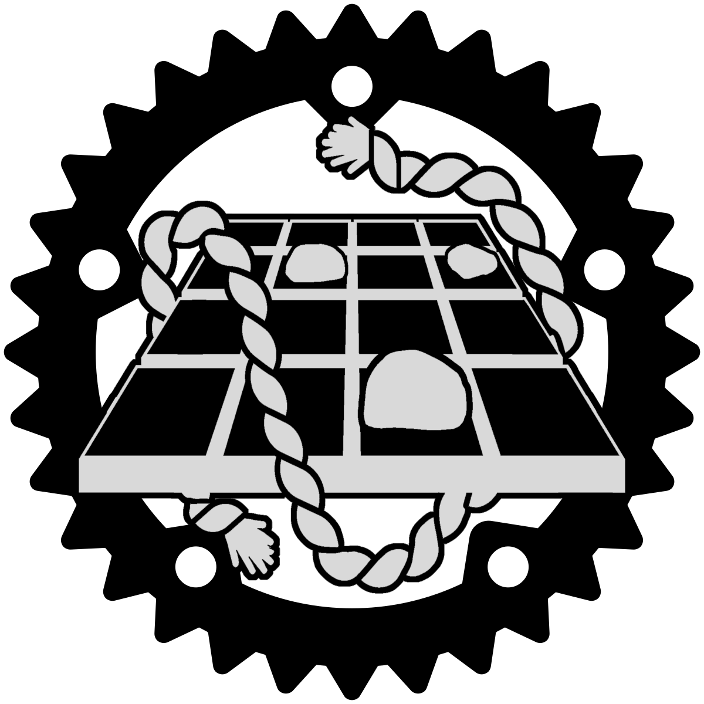

## RUSTBU



A lichess clone of SHOBU powered by Rust.

how 2 run:

1. Get rust

2. `cargo run`

3. ???

4. Profit.

---

## TODO LIST:

### Frontend todo:

- [x] Render the boards on the frontend.
- [x] Create a new game and get a sharable link to it
- [ ] Entering a link joins the game.
- [ ] Navigatable Menu using mouse.
- [ ] Mirror the game for the white player. (i.e. white rocks on bottom)
- [ ] Proper use of websockets.
- [ ] Move using clicks
- [ ] Move by dragging
- [ ] Highlight boards where movement is possible. (homeboards on passive, boards of opposite colour on aggresssive)
- [ ] Locally change board layouts between standard and "dork" (placeholder name)
```
Standard layout:       "DORK" layout:
    [B][W]                [B][W]
    ------                ------
    [B][W]                [W][B]
```
- [ ] Show possible movement path, like in lichess.
- [ ] Max 2 steps per move.
- [ ] Take back passive move locally. (Because we send both at the same time)
- [ ] Aggressive move should have the same size and direction as passive.
- [ ] Prevent the first move from being on the opponent's homeboard.
- [ ] Prevent aggressive move on a board of the same colour as the passive move.

### Backend todo:

- [x] Passive Movement Phase.
- [x] Prevent pushing any rocks in the passive move.
- [x] Max 2 steps per move.
- [x] Prevent the first move from being on the opponent's homeboard.
- [x] Prevent pushing any rocks in the passive move.

- [x] Aggressive Movement Phase.
- [x] Prevent pushing of same coloured rock.
- [x] Prevent pushing of more than 2 rocks at once.
- [x] Prevent aggressive move on a board of the same colour as the passive move.
- [x] Check for winner.
- [x] Change active player if both the passive and aggressive move are OK.
- [x] Unit test movement rules.

- [ ] Proper use of websockets.
- [x] Handle websocket connection.
- [x] Generate link on new game, and redirect.
- [ ] Update state for both players on board change.
- [ ] Unit test websocket gameplay.
- [ ] Joining a game; lobby owner is black, next person to join is white.
- [ ] If a game is full you're spectator.


### Future improvements:

- [ ] Lobby browser.
- [ ] Lobby/in-game chat.
- [ ] Option to select color on lobby creation.
- [ ] Option to surrender.
- [ ] Option to offer draw.
- [ ] Option to ask for takeback.
- [ ] Visual setting, checkered board or "normal" board.
- [ ] bo3, winner plays white next game (goes second).
- [ ] gamemodes?
- [ ] Return to lobby after the game is over.
- [ ] Account.
- [ ] ELO.
- [ ] Friends.
- [ ] Show a little flag next to name.
- [ ] Navigatable page.
- [ ] Themes for boards and pieces.
- [ ] SHOBU engine/AI.

Disclaimer: I do not own SHOBU in any way, shape, or form.  I just find the game neat hence I'm doing this project.

